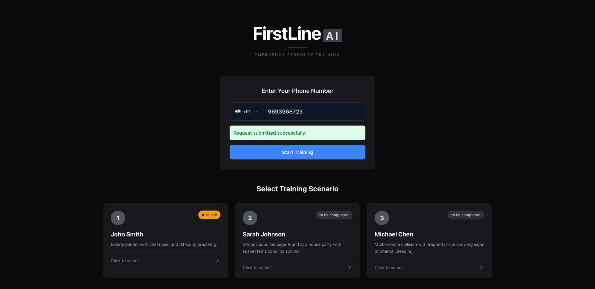
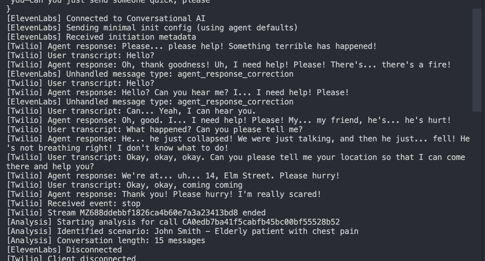
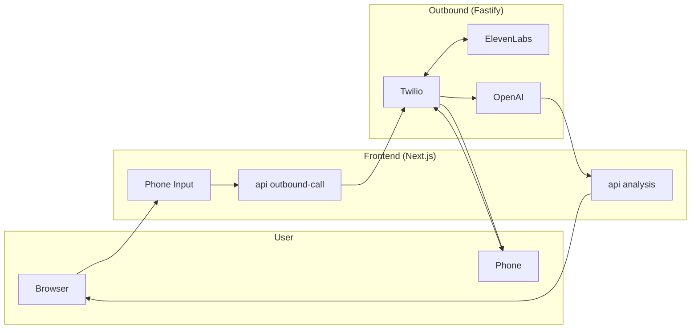
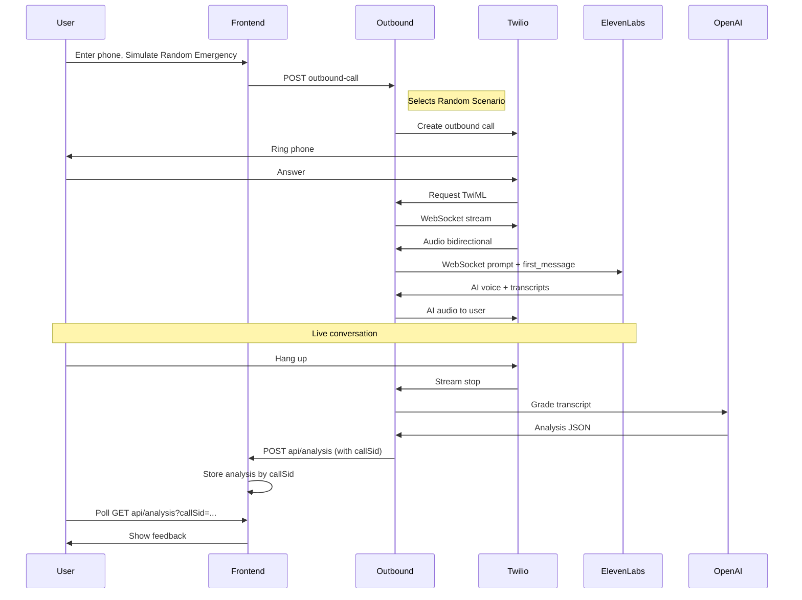

# FirstLine AI

**AI-powered emergency call training on real phone calls.** Instead of choosing a fixed scenario, the system randomly selects an emergency situation (e.g., fire, panic attack, intruder) for you to handle. Enter your number, receive an outbound call, and act as the 999 dispatcher. After the call, the system grades your performance and shows detailed feedback.

- **`frontend/`** — Next.js UI + API routes (proxy + analysis storage)
- **`outbound/`** — Fastify service: Twilio + ElevenLabs + OpenAI

---

## Screenshots

### UI — Training flow

Phone number entry (country code + E.164) and a single action button to start a random simulation.



### Console — Live call and analysis

Outbound service log: ElevenLabs connection, Twilio agent/user transcript (distressed caller, location, confirmation), stream end, and post-call AI analysis.



---

## Architecture

### High-level flow


```mermaid
flowchart LR
  subgraph User
    A[Browser]
    B[Phone]
  end
  subgraph Frontend["Frontend (Next.js)"]
    C[Phone Input]
    D[api outbound-call]
    E[api analysis]
  end
  subgraph Outbound["Outbound (Fastify)"]
    F[Twilio]
    G[ElevenLabs]
    H[OpenAI]
  end
  A --> C
  C --> D
  D --> F
  F --> B
  B <--> F
  F <--> G
  F --> H
  H --> E
  E --> A
```

### End-to-end sequence


```mermaid
sequenceDiagram
  participant U as User
  participant F as Frontend
  participant O as Outbound
  participant T as Twilio
  participant E as ElevenLabs
  participant AI as OpenAI

  U->>F: Enter phone, Simulate Random Emergency
  F->>O: POST outbound-call
  Note right of O: Selects Random Scenario
  O->>T: Create outbound call
  T->>U: Ring phone
  U->>T: Answer
  T->>O: Request TwiML
  O->>T: WebSocket stream
  T->>O: Audio bidirectional
  O->>E: WebSocket prompt + first_message
  E->>O: AI voice + transcripts
  O->>T: AI audio to user
  Note over U,E: Live conversation
  U->>T: Hang up
  T->>O: Stream stop
  O->>AI: Grade transcript
  AI->>O: Analysis JSON
  O->>F: POST api/analysis (with callSid)
  F->>F: Store analysis by callSid
  U->>F: Poll GET api/analysis?callSid=...
  F->>U: Show feedback
```

### Product flow (steps)

| Step | What happens |
|------|----------------|
| 1 | User opens platform → enters phone number with country code. |
| 2 | User clicks **"Simulate Random Emergency"**. |
| 3 | **Outbound Service** picks a random scenario (e.g., Panic Attack, Fire, Intruder). |
| 4 | **Twilio** dials the user's phone. |
| 5 | User answers → Outbound bridges to **ElevenLabs** with the selected scenario prompt. |
| 6 | Live two-way conversation: user (Dispatcher) vs AI (Caller). |
| 7 | Call ends → Outbound triggers **OpenAI** to analyze the transcript. |
| 8 | OpenAI returns graded JSON (score, strengths, improvements, pass/fail). |
| 9 | Analysis is stored on the frontend; UI polls using the unique `callSid` to display results. |

---

## Scenarios (Randomized)

The system currently selects from these emergency situations:

- **Panic Attack / Hyperventilation:** Young person distressed at Central Park.
- **Witnessing a Fire:** Frantic bystander at 12 Maple Street.
- **Found Unconscious Person:** Concerned jogger finding an unresponsive man on 45th Avenue.
- **Intruder Alert:** Terrified homeowner whispering while hiding in a closet at 500 Oak Lane.

---

## API Reference

### Frontend (Next.js)

| Method | Path | Description |
|--------|------|-------------|
| POST | `/api/outbound-call` | Proxies to outbound service. Body: `{ number }`. |
| POST | `/api/analysis` | Stores analysis JSON. Keyed by `callSid`. |
| GET | `/api/analysis?callSid=<SID>` | Returns stored analysis for a specific call session. |

### Outbound (Fastify)

| Method | Path | Description |
|--------|------|-------------|
| POST | `/outbound-call` | Randomly selects scenario and starts Twilio outbound call. |
| GET/POST | `/outbound-call-twiml` | Returns TwiML for media streaming. |
| WebSocket | `/outbound-media-stream` | Bidirectional bridge between Twilio and ElevenLabs. |

---

## Run Locally

### Prerequisites

- Node.js 18+
- Twilio account + phone number
- ElevenLabs API key + Conversational AI agent ID
- OpenAI API key

### 1. Outbound service

```bash
cd outbound
npm install
cp .env.example .env
# Edit .env with Twilio, ElevenLabs, OpenAI, and FRONTEND_URL
node outbound.js
```

### 2. Frontend

```bash
cd frontend
npm install
cp .env.example .env.local
# Set OUTBOUND_CALL_API_URL (e.g. your ngrok URL)
npm run dev
```

---

## Features

- **Random Scenarios:** Dynamic training with multiple emergency personas.
- **Real Phone Calls:** Integration with Twilio for actual voice interaction.
- **Conversational AI:** Natural voice and transcripts via ElevenLabs.
- **AI Evaluation:** OpenAI evaluates performance based on accuracy, tone, and critical steps.
- **Instant Feedback:** View your score and areas for improvement immediately after hanging up.

---

## License

MIT License.
