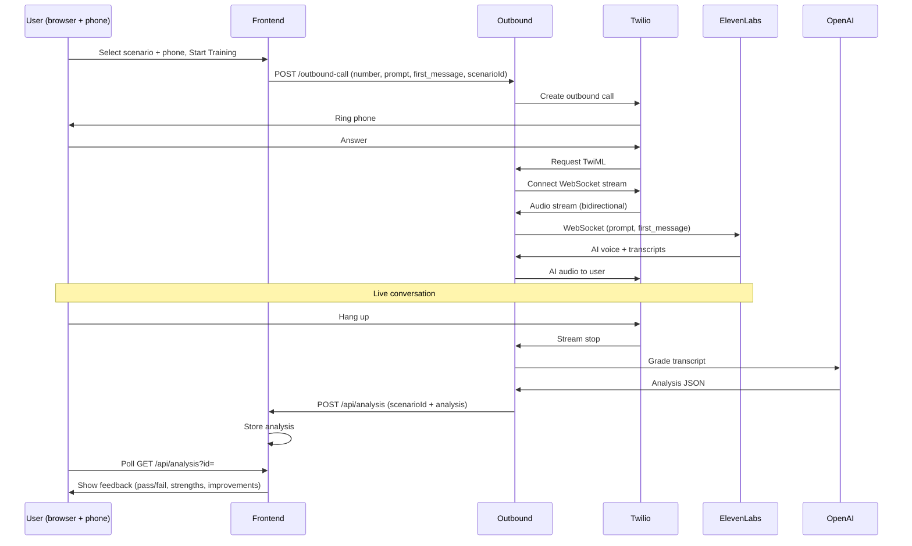

# FirstLine AI

**AI-powered emergency call training on real phone calls.** Trainees choose a scenario, enter their number, receive an outbound call, and handle a live conversation with an AI “caller”. After the call, the system grades performance and shows detailed feedback.

- **`frontend/`** — Next.js UI + API routes (proxy + analysis storage)
- **`outbound/`** — Fastify service: Twilio + ElevenLabs + OpenAI

---

## Architecture & flow

### High-level flow

```mermaid
flowchart LR
  subgraph User
    A[Browser]
    B[Phone]
  end
  subgraph Frontend["Frontend (Next.js)"]
    C[Scenario + Phone]
    D[/api/outbound-call]
    E[/api/analysis]
  end
  subgraph Outbound["Outbound (Fastify)"]
    F[Twilio]
    G[ElevenLabs]
    H[OpenAI]
  end
  A --> C
  C --> D
  D --> F
  F --> B
  B <--> F
  F <--> G
  F --> H
  H --> E
  E --> A
```

### End-to-end sequence



### Components

| Component | Role |
|-----------|------|
| **Frontend** | Scenario list, country+phone input, “Start Training”, stores analysis, polls and shows results |
| **Outbound** | Starts Twilio call, bridges Twilio Media ↔ ElevenLabs, captures transcript, calls OpenAI, POSTs analysis to frontend |
| **Twilio** | Dials user, streams audio to/from outbound service |
| **ElevenLabs** | Conversational AI: plays “caller” voice, returns transcripts |
| **OpenAI** | Grades transcript → JSON (score, strengths, improvements, pass/fail) |

### Data flow (summary)

1. **Browser → Frontend** — User selects scenario, enters phone (with country code), clicks Start Training.
2. **Frontend → Outbound** — `POST /outbound-call` with `number`, `prompt`, `first_message`, `scenarioId`.
3. **Outbound → Twilio** — Create outbound call; Twilio requests TwiML, then opens WebSocket to outbound.
4. **Twilio ↔ Outbound** — Bidirectional audio stream.
5. **Outbound ↔ ElevenLabs** — Same conversation: ElevenLabs gets prompt + first message, returns AI voice + transcripts.
6. **Call end** — Outbound builds transcript, calls OpenAI to grade, then `POST /api/analysis` to frontend (with `scenarioId`).
7. **Frontend** — Saves analysis, UI polls `GET /api/analysis?id=<scenarioId>` and shows feedback.

---

## Product flow (steps)

| Step | What happens |
|------|----------------|
| 1 | User opens platform → sees scenarios (e.g. John Smith, Sarah Johnson, Michael Chen) and status (to be completed / in call / passed / failed). |
| 2 | User selects a scenario (pre-defined prompt + first message for the AI caller). |
| 3 | User selects country code + enters phone number. |
| 4 | User clicks “Start Training” → frontend proxies to outbound → Twilio dials user. |
| 5 | User answers → Twilio streams audio to outbound → outbound connects ElevenLabs with scenario prompt + first message → AI “caller” speaks (e.g. panic, fear). |
| 6 | Live two-way conversation: user speaks → ElevenLabs responds with voice + transcripts. |
| 7 | Call ends (user or system) → outbound receives stream stop. |
| 8 | Outbound sends transcript to OpenAI → receives graded JSON (score, strengths, improvements, pass/fail). |
| 9 | Outbound POSTs analysis to frontend → frontend stores it; UI polls and shows feedback. |
| 10 | User can repeat the same scenario or pick another. |

---

## API reference

### Frontend (Next.js)

| Method | Path | Description |
|--------|------|-------------|
| POST | `/api/outbound-call` | Proxies to `OUTBOUND_CALL_API_URL/outbound-call`. Body: `{ number, prompt, first_message, scenarioId }`. |
| POST | `/api/analysis` | Stores analysis JSON (expects `scenarioId`, `pass_fail`, `overall_rating`, etc.). |
| GET | `/api/analysis?id=<scenarioId>` | Returns stored analysis for that scenario. |

### Outbound (Fastify)

| Method | Path | Description |
|--------|------|-------------|
| POST | `/outbound-call` | Starts Twilio outbound call. |
| GET/POST | `/outbound-call-twiml` | Returns TwiML: `<Connect><Stream url="wss://.../outbound-media-stream">`. |
| WebSocket | `/outbound-media-stream` | Twilio Media Stream; outbound bridges to ElevenLabs. |
| GET | `/analysis/:callSid` | Debug: returns latest saved analysis file for that call. |

---

## Run locally

### Prerequisites

- Node.js 18+
- Twilio account + phone number
- ElevenLabs API key + Conversational AI agent ID
- OpenAI API key

### 1. Outbound service

```bash
cd outbound
npm install
cp .env.example .env
# Edit .env with Twilio, ElevenLabs, OpenAI, and optional FRONTEND_URL
node outbound.js
```

Runs by default on `http://localhost:8000`.  
**Note:** Twilio needs a **public HTTPS** URL for webhooks and media. For local dev, expose the outbound service with a tunnel (e.g. [ngrok](https://ngrok.com)) and use that URL in Twilio and in the frontend env.

### 2. Frontend

```bash
cd frontend
npm install
cp .env.example .env.local
# Set OUTBOUND_CALL_API_URL (e.g. http://localhost:8000 or your ngrok URL)
npm run dev
```

Open [http://localhost:3000](http://localhost:3000).

### Env summary

| Where | Variable | Purpose |
|-------|----------|---------|
| outbound | `TWILIO_ACCOUNT_SID`, `TWILIO_AUTH_TOKEN`, `TWILIO_PHONE_NUMBER` | Twilio outbound calls |
| outbound | `ELEVENLABS_API_KEY`, `ELEVENLABS_AGENT_ID` | ElevenLabs Conversational AI |
| outbound | `OPENAI_API_KEY` | Grading transcript |
| outbound | `FRONTEND_URL` (optional) | URL for POSTing analysis (defaults to example URL in code) |
| frontend | `OUTBOUND_CALL_API_URL` | Base URL of outbound service (no trailing slash) |

---

## Features

- **Scenarios:** John Smith (chest pain), Sarah Johnson (unconscious / alcohol), Michael Chen (multi-vehicle collision).
- **Country + phone:** Country code selector with flags; E.164 validation.
- **Real calls:** Training happens on an actual phone call via Twilio.
- **AI caller:** ElevenLabs provides natural “caller” voice and behavior from scenario prompts.
- **Grading:** OpenAI evaluates transcript (location, symptoms, tone, critical steps) and returns structured feedback.
- **Feedback UI:** Pass/fail, score, strengths, areas for improvement, information handling, action assessment.

---

## License

MIT License.
